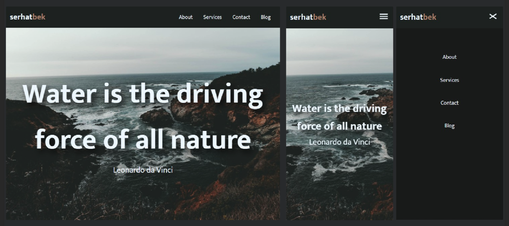

# Responsive NavBar

Responsive navbar is a small Vanilla JS project to get better at JavaScript DOM manipulation.

---

## Tech Stack

**Client:** HTML, CSS, JavaScript

---

## Lessons Learned

- I should check widths of elements and font-sizes to prevent overflow on different screen sizes.

---

## Project Goal

- Select burger button
- Add event listener to button
- Toggle navbar on click
- Toggle custom burger button

## Live

You can check the project here. [▶ Responsive Navbar](https://res-navbar.netlify.app/).
